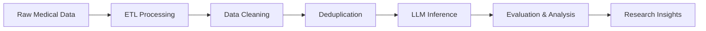

# VM14K-Megarepo Documentation

Welcome to the comprehensive documentation for the VM14K-Megarepo project - a complete pipeline for Vietnamese medical data processing and large language model (LLM) benchmarking.

## 📚 Documentation Overview

This documentation provides everything you need to understand, setup, use, and extend the VM14K system:

### Core Documentation

| Document | Description | Audience |
|----------|-------------|----------|
| **[Architecture Guide](ARCHITECTURE.md)** | System design, data flow, and component interactions | Developers, Architects |
| **[Setup Guide](SETUP.md)** | Installation, configuration, and environment setup | Users, DevOps |
| **[User Guide](USER_GUIDE.md)** | Step-by-step usage instructions and examples | Researchers, Data Scientists |
| **[API Reference](API_REFERENCE.md)** | Complete REST API documentation for ETL service | Developers, Integrators |

### Quick Navigation

#### 🚀 Getting Started
- New to the project? Start with [Setup Guide](SETUP.md)
- Need to understand the system? Read [Architecture Guide](ARCHITECTURE.md)
- Ready to use it? Follow the [User Guide](USER_GUIDE.md)

#### 🔧 Development
- Building integrations? Check [API Reference](API_REFERENCE.md)
- Working on components? See individual README files in each directory

#### 📊 Research & Analysis
- Running benchmarks? Use [User Guide - Evaluation](USER_GUIDE.md#evaluation-and-analysis)
- Analyzing results? See [Evaluation README](../Evaluation/README.md)

## 🎯 Project Overview

The VM14K-Megarepo is designed to solve the complete workflow for Vietnamese medical LLM benchmarking:



### Key Features

- **📥 Multi-source Data Extraction**: PostgreSQL, MongoDB, S3, web scraping
- **🧹 LLM-powered Data Cleaning**: Automated HTML removal, format standardization
- **🔄 Advanced Deduplication**: Three-tier approach (exact, similarity, topic-based)
- **🤖 Multi-provider LLM Inference**: OpenAI, Azure, AWS Bedrock, Gemini, Groq, DeepSeek
- **📈 Comprehensive Evaluation**: Pass@k metrics, ensemble analysis, statistical testing
- **🏗️ Scalable Architecture**: Microservices, Docker support, cloud-ready

## 🏗️ System Components

### 1. DataPlatformEtlService
**Purpose**: Central data acquisition and processing hub

**Key Features**:
- RESTful API for data operations
- Multi-source extraction capabilities
- DuckDB and Spark transformations
- Real-time job monitoring

**Documentation**: 
- [API Reference](API_REFERENCE.md)
- [Component README](../DataPlatformEtlService/README.md)

### 2. DataCleaning
**Purpose**: LLM-powered data quality improvement

**Key Features**:
- HTML tag removal
- Format standardization
- Vietnamese language validation
- Medical content verification

**Documentation**: 
- [Component README](../DataCleaning/README.md)

### 3. Deduplication
**Purpose**: Remove duplicate and irrelevant content

**Key Features**:
- Exact match detection
- Similarity-based filtering (>90% threshold)
- Off-topic question removal

**Documentation**: 
- [Component README](../Deduplication/README.md)

### 4. Inference Framework
**Purpose**: Multi-provider LLM benchmarking

#### APIServices
- **Providers**: OpenAI, Azure OpenAI, AWS Bedrock, Google Gemini, Groq, DeepSeek
- **Features**: Batch processing, cost tracking, parallel execution

#### SelfHost
- **Technology**: vLLM server integration
- **Features**: Local model deployment, GPU optimization

**Documentation**: 
- [APIServices README](../Inference/APIServices/README.md)
- [SelfHost README](../Inference/SelfHost/README.MD)

### 5. Evaluation Suite
**Purpose**: Comprehensive model performance assessment

**Key Features**:
- Pass@k metrics calculation
- Ensemble model evaluation
- Statistical significance testing
- Performance visualization

**Documentation**: 
- [Component README](../Evaluation/README.md)

## 🚀 Quick Start

### 1. Basic Setup (5 minutes)
```bash
# Clone repository
git clone https://github.com/your-org/VM14K-Megarepo.git
cd VM14K-Megarepo

# Setup ETL service
cd DataPlatformEtlService
pip install -r requirements.txt
python server.py
```

### 2. Full Pipeline Setup (30 minutes)
Follow the comprehensive [Setup Guide](SETUP.md) for complete installation.

### 3. Run Your First Benchmark (1 hour)
Use the [User Guide](USER_GUIDE.md) to process sample data and run inference.

## 📋 Prerequisites

### System Requirements
- **OS**: Linux (Ubuntu 18.04+), macOS (10.15+), or Windows 10+
- **Python**: 3.8 or higher
- **Memory**: 8GB RAM (16GB+ recommended)
- **Storage**: 50GB free space
- **GPU**: Optional for self-hosted inference (CUDA 11.8+ compatible)

### Required Software
- Git
- Docker (optional but recommended)
- Python 3.8+
- Database systems (PostgreSQL, MongoDB, etc.)

### API Keys (for inference)
- OpenAI API key
- Azure OpenAI credentials
- AWS credentials (for Bedrock)
- Google API key (for Gemini)
- Groq API key
- DeepSeek credentials

## 🎓 Usage Patterns

### For Researchers
1. **Data Collection**: Use ETL service to gather medical questions
2. **Data Quality**: Apply cleaning and deduplication processes
3. **Model Testing**: Run inference across multiple LLM providers
4. **Analysis**: Use evaluation notebooks for statistical analysis

### For Developers
1. **API Integration**: Use REST APIs for custom workflows
2. **Component Extension**: Add new data sources or LLM providers
3. **Pipeline Automation**: Create scheduled ETL pipelines
4. **Monitoring**: Implement custom metrics and alerts

### For Data Scientists
1. **Exploratory Analysis**: Use Jupyter notebooks for data exploration
2. **Feature Engineering**: Create custom data transformations
3. **Model Comparison**: Benchmark multiple models systematically
4. **Insight Generation**: Develop domain-specific evaluation metrics

## 🔧 Common Tasks

### Extract Medical Data
```bash
curl -X POST http://localhost:8000/extract \
  -H "Content-Type: application/json" \
  -d '{
    "source_type": "postgresql",
    "connection": {"host": "localhost", "database": "medical_data"},
    "query": "SELECT * FROM vietnamese_questions",
    "output_format": "csv"
  }'
```

### Clean Dataset
```bash
cd DataCleaning
python classification.py \
  --input raw_data.csv \
  --output cleaned_data.csv \
  --model gpt-3.5-turbo
```

### Remove Duplicates
```bash
cd Deduplication
python deduplication.py --input_path cleaned_data.csv
```

### Run LLM Inference
```bash
cd Inference/APIServices
uv run batch_run.py
```

### Analyze Results
```bash
cd Evaluation
jupyter notebook benchmark_analysis.ipynb
```

## 📊 Key Metrics & KPIs

### Data Quality Metrics
- **Cleaning Effectiveness**: % of HTML tags removed, format consistency
- **Deduplication Efficiency**: Exact duplicates removed, similarity matches
- **Language Accuracy**: Vietnamese content verification rates

### Performance Metrics
- **Processing Speed**: Rows processed per second, job completion times
- **API Response Times**: Average latency by provider, error rates
- **Resource Utilization**: CPU/memory usage, GPU utilization

### Model Evaluation Metrics
- **Pass@k Accuracy**: Success rates at k=1, 3, 5
- **F1 Scores**: Precision and recall balance
- **Statistical Significance**: Confidence intervals, p-values
- **Cost Efficiency**: Performance per dollar spent

## 🏆 Best Practices

### Data Management
- **Version Control**: Track dataset versions and transformations
- **Quality Assurance**: Validate data at each pipeline stage
- **Backup Strategy**: Regular backups of processed datasets
- **Documentation**: Maintain data lineage and processing logs

### Infrastructure
- **Monitoring**: Set up comprehensive system monitoring
- **Scaling**: Design for horizontal scaling from day one
- **Security**: Implement proper authentication and encryption
- **Cost Control**: Monitor and optimize cloud resource usage

### Development
- **Testing**: Comprehensive unit and integration tests
- **Code Quality**: Use linting, formatting, and type checking
- **Documentation**: Keep code and API documentation current
- **Version Management**: Use semantic versioning for releases

## 🛠️ Extension Points

### Adding New Data Sources
1. Implement extractor interface in `DataPlatformEtlService`
2. Add connection configuration schema
3. Create data transformation mappings
4. Update API documentation

### Integrating New LLM Providers
1. Add provider interface in `Inference/APIServices`
2. Implement authentication handling
3. Configure rate limiting and error handling
4. Update batch processing logic

### Custom Evaluation Metrics
1. Extend evaluation framework in `Evaluation/`
2. Implement metric calculation functions
3. Add visualization components
4. Update reporting pipeline

## 🐛 Troubleshooting

### Common Issues
- **Installation Problems**: Check [Setup Guide troubleshooting](SETUP.md#troubleshooting)
- **API Errors**: Verify credentials and rate limits
- **Memory Issues**: Adjust batch sizes and resource allocation
- **Performance Problems**: Monitor and optimize bottlenecks

### Getting Help
- **Documentation**: Check relevant guide documents
- **GitHub Issues**: Report bugs and request features
- **Community**: Join discussions and share experiences
- **Support**: Contact maintainers for urgent issues

## 📈 Roadmap

### Short-term (Next 3 months)
- Enhanced error handling and recovery
- Additional LLM provider integrations
- Improved monitoring and alerting
- Performance optimizations

### Medium-term (3-6 months)
- Real-time data streaming capabilities
- Advanced deduplication algorithms
- Multi-language support expansion
- Automated model selection

### Long-term (6+ months)
- Federated learning integration
- Privacy-preserving techniques
- Automated prompt optimization
- Advanced visualization dashboard

## 🤝 Contributing

We welcome contributions! Here's how to get started:

1. **Read Documentation**: Understand the system architecture
2. **Setup Development Environment**: Follow development setup guide
3. **Choose an Issue**: Pick from GitHub issues or propose new features
4. **Submit Pull Request**: Follow contribution guidelines
5. **Review Process**: Collaborate with maintainers on feedback

### Contribution Areas
- **Core Components**: Improve ETL, cleaning, inference, evaluation
- **Integrations**: Add new data sources and LLM providers
- **Documentation**: Enhance guides and examples
- **Testing**: Expand test coverage and validation
- **Performance**: Optimize processing and reduce costs

## 📄 License

This project is licensed under the Apache License 2.0. See [LICENSE](../LICENSE.md) for details.

## 📞 Contact & Support

- **Project Website**: [VM14K Project Site](https://venera-ai.github.io/VM14K/)
- **Dataset**: [HuggingFace Dataset](https://huggingface.co/datasets/venera-ai/VietnameseMedBench/)
- **GitHub Repository**: [VM14K-Megarepo](https://github.com/your-org/VM14K-Megarepo)
- **Issues**: [GitHub Issues](https://github.com/your-org/VM14K-Megarepo/issues)

### Research Citation
If you use this project in your research, please cite our paper:

```bibtex
@misc{nguyen2025vm14kvietnamesemedicalbenchmark,
      title={VM14K: First Vietnamese Medical Benchmark}, 
      author={Thong Nguyen and Duc Nguyen and Minh Dang and Thai Dao and Long Nguyen and Quan H. Nguyen and Dat Nguyen and Kien Tran and Minh Tran},
      year={2025},
      eprint={2506.01305},
      archivePrefix={arXiv},
      primaryClass={cs.CL},
      url={https://arxiv.org/abs/2506.01305}, 
}
```

---

**Ready to get started?** Choose your path:
- 🆕 New user: [Setup Guide](SETUP.md)
- 🔧 Developer: [Architecture Guide](ARCHITECTURE.md)
- 📊 Researcher: [User Guide](USER_GUIDE.md)
- 🔌 Integrator: [API Reference](API_REFERENCE.md)